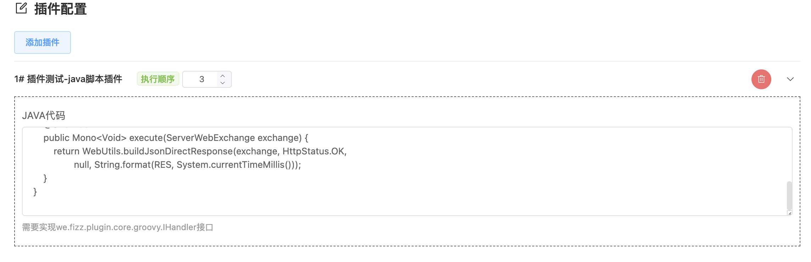

## 插件说明

Groovy 插件用于做插件里执行 Java 代码。

代码里可以使用 @Resource、@AutoWired 和 @Qualifier 三个注解来注入 spring bean。

主要适用场景：
> 1、插件逻辑都比较简单。执行一段简单逻辑后，就直接返回执行结果；或者执行一段代码用于修改一些运行时数据
>
> 2、需要使用插件临时验证一下
>
> 3、不想引入新的插件依赖，重新打包发版

## 使用说明

1、做网关后台添加插件：网关管理 -> 插件管理 -> 新增

> 插件名称：groovyPlugin
>
> 表单定义：

```json
[
  {
    "field": "codeSource",
    "label": "JAVA代码",
    "component": "textarea",
    "dataType": "string",
    "desc": "需要实现we.fizz.plugin.groovy.IHandler接口",
    "rules": []
  }
]
```


2、在路由里添加插件，填入要执行的 Java 代码



代码示例(返回服务器当前时间)：

```java
package we.fizz.plugin.groovy.handler;

import org.springframework.http.HttpStatus;
import org.springframework.web.server.ServerWebExchange;
import reactor.core.publisher.Mono;
import we.fizz.plugin.groovy.IHandler;
import we.util.WebUtils;

public class CurrentTime implements IHandler {
    private static final String RES = "{\"code\":0,\"msg\":null,\"result\":%s}";

    @Override
    @SuppressWarnings("unchecked")
    public Mono<Void> execute(ServerWebExchange exchange) {
        return WebUtils.buildJsonDirectResponse(exchange, HttpStatus.OK,
                null, String.format(RES, System.currentTimeMillis()));
    }
}
```


