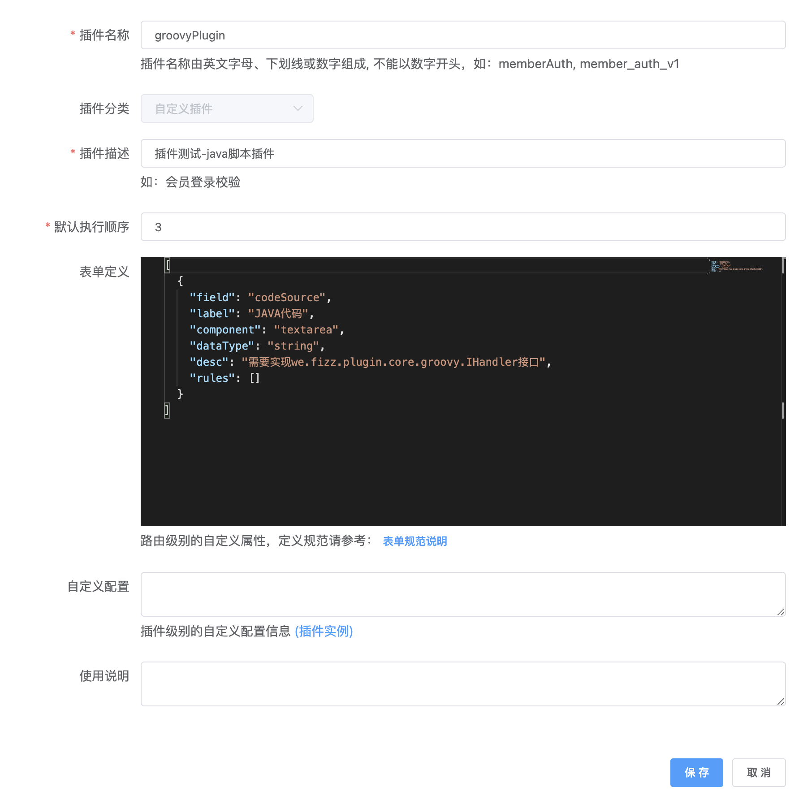

## 概述

Groovy 插件用于插件里执行 Java 代码。

## 插件说明

代码里可以使用 @Resource、@AutoWired 和 @Qualifier 三个注解来注入 spring bean。

主要适用场景：
> 1、插件逻辑都比较简单。执行一段简单逻辑后，就直接返回执行结果；或者执行一段代码用于修改一些运行时数据
>
> 2、需要使用插件临时验证一下
>
> 3、不想引入新的插件依赖，重新打包发版

## 使用说明
I、gateway项目pom文件中引入以下依赖：

```xml
<dependency>
    <groupId>com.fizzgate</groupId>
    <artifactId>fizz-plugin-groovy</artifactId>
    <version>${fizz.version}</version>
</dependency>
```

II. 管理后台导入以下SQL

 ```sql
     INSERT INTO `tb_plugin` (`fixed_config`, `eng_name`, `chn_name`, `config`, `order`, `instruction`, `type`, `create_user`, `create_dept`, `create_time`, `update_user`, `update_time`, `status`, `is_deleted`) VALUES 
     ('', 'groovy-plugin', 'Groovy插件', '[{"field":"codeSource","label":"JAVA代码","component":"textarea","dataType":"string","desc":"需要实现we.fizz.plugin.core.groovy.IHandler接口","rules":[]}]', 1, '', 2, NULL, NULL, NULL, NULL, NULL, 1, 0);
 ```

更多网关二次开发请参考[网关快速开发](https://www.fizzgate.com/fizz/guide/fast-dev/fast-dev.html) 、[插件开发样例](https://www.fizzgate.com/fizz/guide/plugin/)

III、在路由里添加插件，填入要执行的 Java 代码



代码示例(返回服务器当前时间)：

```java
package we.fizz.plugin.groovy.handler;

import org.springframework.http.HttpStatus;
import org.springframework.web.server.ServerWebExchange;
import reactor.core.publisher.Mono;
import we.fizz.plugin.groovy.IHandler;
import we.util.WebUtils;

public class CurrentTime implements IHandler {
    private static final String RES = "{\"code\":0,\"msg\":null,\"result\":%s}";

    @Override
    @SuppressWarnings("unchecked")
    public Mono<Void> execute(ServerWebExchange exchange) {
        return WebUtils.responseJson(exchange, HttpStatus.OK,
                null, String.format(RES, System.currentTimeMillis()));
    }
}
```


